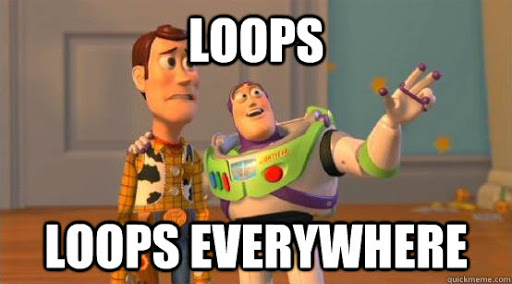

# Nested For Loops


Loops offer a quick and easy way to do something repeatedly. There are a handful of `loop` statement in JavaScript, such as: `for`, `for/in`, and `while` to name a few. Today we will learn about `nested for loops`.

## Prerequisites
* Basic JavaScript Syntax
* Basic Data Types
* Arrays
* Basic For Loops

## Objectives
By the end of this lesson developers should be able to:

* Utilize `nested for loops` to output data to the console
* Distinguish the difference between a `for loop` and a `nested for loop`

## Basic For Loops
A `for loops` basic functionality is to continuously execute a specific block of code until a `test expression` is evaluated to `false`.

Example:
```js
const captains = ['Picard', 'Kirk', 'Janeway', 'Sisko']

for(let i = 0; i < captains.length; i++){
    console.log(`${captains[i]}`)
}
```

The above example will iterate over the array of Captains and `console.log` each Captains' name.


## Nested For Loops
We commonly utilize `nested for loops` to place one loop inside of another, this allows us to dynamically combine data to output a desired result.


#### We Do:
Let's make our console act out a Star Trek: Short Trek where Captain Picard get stuck in a time loop.


```js
for(let i = 3; i > 0; i--){
    console.log("Mr. Crusher! Engage in:")
    for(let j = 3; j > 0; j--){
        console.log(j)
    }
}
```

As you can see above we are defining two separate loops:
1. The `Outer Loop`: Where we define `i` and say for each time `i` is greater than 0; we want the console to output: `Mr Crusher! Engage in:`

2. The `Inner Loop`: Where we define `j` and say for each time `j` is greater than 0; we want the console to output: `j`


<details>
  <summary>So what is happening inside this `Nested For Loop`?</summary>

By nesting the `Inner Loop` inside of the `Outer Loop` we are able to:
  1. Execute our `Outer Loop` which outputs Captain Picard's command once
  2. Then `Inner Loop` is executed and outputs its `console log` until its condition is evaluated as true; ie: `3`, `2`, `1`
  3. Then the `Out Loop` picks up where it left off and outputs Captain Picard's command again because its condition has not been met
  4. Which then causes the the `Inner Loop` to execute again and repeat step two listed above
  5. Then we run through step one and two one more time due to the `Out Loop` not ceasing to execute until its condition is evaluated to true
</details>

<br/>
<br/>


#### Challenge
Can you decipher what is going on here in the code below?

```js
let captainsOrder = "Mr. Crusher! Engage in:"
let countDown = [3, 2, 1, 'Engage!']

for(let i = 3; i > 0; i--){
    console.log(captainsOrder)
    for(let j = 0; j < countDown.length; j++){
        console.log(countDown[j])
    }
}
```


